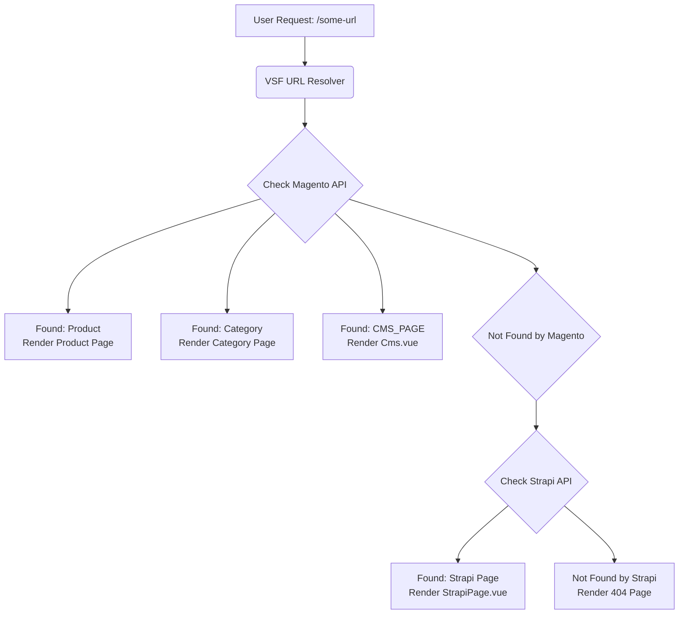

# vsf-middleware-integration
This repo describes the middleware setup for strapi and composable created in VSF
<div align="center">

</div>
# Alokai integration with Magento2

Repository is a starter Alokai application integrated with Magento2.

---

## Strapi CMS Integration

This project features a deep integration with Strapi CMS to manage dynamic content, such as pages and blog articles. The integration is designed to be robust and scalable, leveraging a custom server middleware, a GraphQL-powered API layer, and a structured composable architecture.

### 1. Custom Server Middleware

The core of the integration is a custom server middleware located at `vsf/serverMiddleware/strapi-api.js`. This middleware acts as a proxy between the Vue Storefront frontend and the Strapi backend. Its primary responsibilities are:

-   **Exposing a single API endpoint** (`/api/strapi`) to the frontend for all Strapi-related requests.
-   **Mapping frontend requests** to the appropriate GraphQL queries.
-   **Executing GraphQL queries** against the Strapi `/graphql` endpoint.
-   **Transforming the response** to a consistent format that the frontend composables can easily consume.

This middleware is registered in `nuxt.config.js` under the `serverMiddleware` array, which links the `/api/strapi` path to the handler file:

```javascript
// nuxt.config.js
export default {
  // ...
  serverMiddleware: [
    // ...
    {
      path: '/api/strapi', handler: '~/serverMiddleware/strapi-api.js'
    }
  ]
}
```

This approach provides a clean separation of concerns, keeping complex queries and backend communication on the server side.

### 2. GraphQL API Layer

The middleware dynamically reads GraphQL query files from the `vsf/serverMiddleware/strapi-queries/` directory based on the `endpoint` parameter in the request. This allows for clean and maintainable queries.

The available API endpoints are:

| Description      | Method | URL                                                                                |
| ---------------- | ------ | ---------------------------------------------------------------------------------- |
| **Pages**        |        |                                                                                    |
| Pages List       | `GET`  | `http://localhost:3000/api/strapi/?endpoint=getPages&limit=5`                        |
| Single Page      | `GET`  | `http://localhost:3000/api/strapi/?endpoint=getPage&slug=trending-in-mens`           |
| **Blogs**        |        |                                                                                    |
| Blogs List       | `GET`  | `http://localhost:3000/api/strapi/?endpoint=getArticles&limit=5`                     |
| Single Blog      | `GET`  | `http://localhost:3000/api/strapi/?endpoint=getArticle&slug=love-the-nature`         |
| **Categories**   |        |                                                                                    |
| Categories       | `GET`  | `http://localhost:3000/api/strapi/?endpoint=getCategories`                           |
| Single Category  | `GET`  | `http://localhost:3000/api/strapi/?endpoint=getCategory&slug=category`               |
| **Authors**      |        |                                                                                    |
| Authors          | `GET`  | `http://localhost:3000/api/strapi/?endpoint=getAuthors`                              |
| Single Author    | `GET`  | `http://localhost:3000/api/strapi/?endpoint=getAuthor&email=johndoe@mailinator.com`  |

### 3. Composable Architecture

The frontend interacts with the Strapi API via a set of structured composables located in `vsf/composables/useStrapi/`. Each content type has its own composable (e.g., `useStrapiPages`, `useStrapiArticles`), which encapsulates the logic for fetching and managing its specific data.

These composables provide a clean, reactive, and reusable way to access Strapi data from any Vue component. For example, `useStrapiArticles` includes functions for searching, paginating, and loading more articles.

### 4. Dynamic Pages and Routes

The Strapi integration powers several key parts of the frontend:

-   **Dynamic Pages:** Generic pages created in Strapi are rendered using the `vsf/pages/StrapiPage.vue` component. This component uses the `useStrapiPages` composable to fetch page data based on the URL slug.
    -   URL Structure: `http://localhost:3000/default/<page-slug>`
-   **Blog Listing Page:** A dedicated page at `vsf/pages/blog/index.vue` displays a paginated grid of all blog articles.
    -   URL: `http://localhost:3000/default/blog`
-   **Blog Detail Page:** Individual blog posts are rendered on a dynamic route that fetches the specific article data.
    -   URL Structure: `http://localhost:3000/default/blog/<blog-slug>`

This setup allows content managers to create and edit pages and blog posts in Strapi, with the changes automatically reflected on the Vue Storefront site.

### 5. Dynamic Page Routing (URL Resolution)

A key feature of this project is its ability to seamlessly serve content from both Magento (for products, categories, and its own CMS pages) and Strapi (for dynamic content pages and blogs). This is achieved through a smart URL resolution strategy that determines the type of content a URL corresponds to before rendering the page.

Here is a step-by-step breakdown of the process:

#### Step 1: The Request
A user navigates to a URL (e.g., `/some-page`). The request is intercepted by Vue Storefront's routing system before a specific page component is rendered.

#### Step 2: Check Magento First (The Primary Source)
The `useUrlResolver` composable makes an API call to the main VSF Middleware server, which queries the Magento GraphQL API. It essentially asks Magento, "Do you recognize this URL?"

Magento can respond in several ways:
-   If the URL is a product, it returns `{ type: 'PRODUCT', ... }`.
-   If the URL is a category, it returns `{ type: 'CATEGORY', ... }`.
-   If the URL is a Magento CMS Page, it returns `{ type: 'CMS_PAGE', ... }`.

If a match is found, the system proceeds to render the appropriate component (e.g., `Cms.vue` for a Magento CMS page).

#### Step 3: Fallback to Strapi (The Content Source)
If Magento returns a "404 Not Found" error, the application does not give up. Instead, it triggers a fallback mechanism. It now asks Strapi, "Do you recognize this URL?"

An API call is made to our custom server middleware (`/api/strapi`) with the page's slug.

#### Step 4: Render the Correct Component
Based on the results of the resolution process, the application makes a final decision:
-   If **Magento** recognized the URL as a CMS page, **`Cms.vue`** is rendered.
-   If **Strapi** recognized the URL, **`StrapiPage.vue`** is rendered.
-   If **neither system** recognizes the URL, a standard **404 Not Found** page is displayed.

This entire process is invisible to the user, providing a unified experience where content can be managed in the system best suited for the job.

#### Visual Flowchart

The following diagram illustrates the decision-making process:



---

### Requirements:
- NodeJS >=14 <=16
- Yarn
- [Magento2](https://docs.magento.com/user-guide/)

### Where to start?

To get started, see the following guides:

- [Introduction](https://docs.vuestorefront.io/v2/getting-started/introduction.html) to learn what is Alokai

- [Configuring Magento2](https://docs.vuestorefront.io/magento/installation-setup/configure-magento.html) to setup your Magento2 store

- [Configuring Alokai](https://docs.vuestorefront.io/magento/installation-setup/configure-integration.html) to install and setup new Alokai project for Magento2

### Local dev setup
```bash
# install dependencies
$ yarn install

# serve with hot reload at localhost:3000
$ yarn dev
```

### Multistore local dev setup
1. Install [docker](https://docs.docker.com/get-docker/) and [docker-compose](https://docs.docker.com/compose/install/) on your local machine.

2. Add your hosts to the `/etc/hosts` file:
    ```
    127.0.0.1       myshop1.local myshop2.local
    ```

3. Set `API_BASE_URL=/api/` env variable in the `.env` file.

4. If you're using Linux: uncomment lines 10 and 11 in the `docker-compose.yml` file.

5. Add your hosts to the `server_name` option inside the `docker/nginx/nginx.conf` file:
    ```
    server_name localhost myshop1.local myshop2.local;
    ```

6. Because this is a local dev setup and nginx is configured to use an unsecured HTTP connection, the `middleware.config.js` file needs to be updated to disable the secure cookie option. To achieve this, you can modify the `cookiesDefaultOpts` object in the `magento` integration section of the `middleware.config.js` file as follows:
    ```js
    module.exports = {
      integrations: {
        magento: {
          configuration: {
            cookiesDefaultOpts: {
              secure: process.env.VSF_COOKIE_SECURE || false,
            }
          }
        }
      }
    };
    ```

7. Start docker-compose daemon:
    ```bash
    $ docker-compose up -d
    ```

8. Start storefront dev server:
    ```bash
    $ yarn dev
    ```

## Resources

- [Alokai Documentation](https://docs.vuestorefront.io/v2/)
- [Alokai Enterprise Documentation](https://docs.vuestorefront.io/v2/general/enterprise.html)
- [Magento2 Integration Documentation](https://docs.vuestorefront.io/magento/)
- [API References](https://docs.vuestorefront.io/magento/api-reference/)
- [Community Chat](http://discord.vuestorefront.io)

## Support

If you have any questions about this integration we will be happy to answer them on  `Magento2` channel on [our Discord](http://discord.vuestorefront.io).
